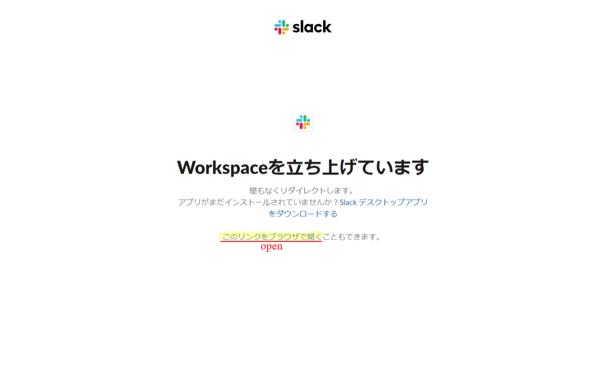

# slack-archives-opener

Language: JP [EN](README_EN.md)

このツールはSlackのアーカイブ・ページのリンクを自動的に開くChromeの拡張機能です。

## 機能

### 見ているページのタスクを作成できます

### ページ内のリンクのタスクを作成できます

## 今後の予定

[Issues](https://github.com/GOAMI-Takaaki/slack-archives-opener/issues) で確認する事ができます。

## 始めるには

### 前提条件

- Google Chrome

### 準備

1. [リリース](https://github.com/GOAMI-Takaaki/slack-archives-opener/releases)から最新をダウンロードします
1. ダウンロードしたファイルを任意のフォルダに解凍します

### インストール

1. Chromeで[拡張機能](chrome://extensions/) ページを開きます
1. デベロッパーモードをオンにします
1. 「パッケージ化されていない拡張機能を読み込む」でダイアログを開き、フォルダを選択します

## リリース

1. [Developer DashBoard](https://chrome.google.com/webstore/devconsole)で最新をアップロードする

## 貢献

1. このレポジトリを自分のアカウントにフォークします
1. レポジトリをクローンします
1. 何かしら変更を行い、テストをします
1. プルリクエストを送ります

## ライセンス

このツールはMIT Licenseです。詳しくは [LICENSE](LICENSE)を確認してください。

## 連絡

[Discussion](https://github.com/GOAMI-Takaaki/slack-archives-opener/discussions) を使ってください。
